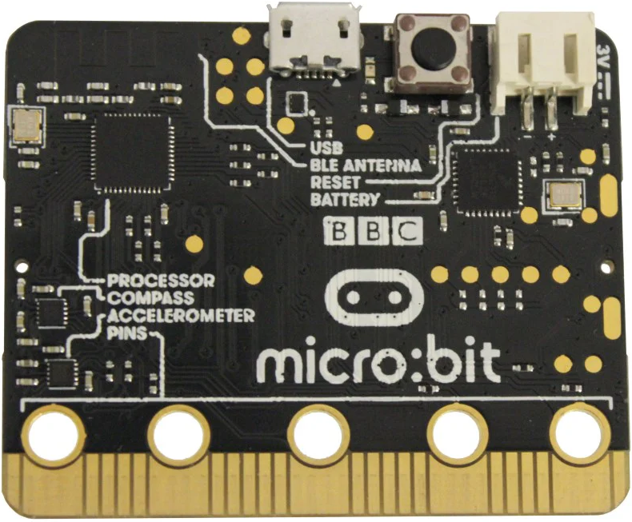

# Micro:bit - Coding Pirates Midtfyn

---

## Plan for dagen

- Velkommen & Setup
- Introduktion til micro:bit
- Login til micro:bit
- Udlevering af micro:bit
- Programmering i MakeCode
- Kage!

---

<!-- .slide: data-background="images/coffee.png" -->

---

<!-- .slide: data-background="images/fortnight.png" -->

---

<!-- .slide: data-background="images/phone.png" -->

---

<iframe width="1900" height="2000" src="https://www.youtube.com/embed/twmWOseADQQ" title="YouTube video player" frameborder="0" allow="accelerometer; autoplay; clipboard-write; encrypted-media; gyroscope; picture-in-picture" allowfullscreen>
</iframe>

---

<!-- .slide: data-background="images/phone.png" -->

--- 

Hvad har de til fælles?

- Kaffemaskine
- Computerspil
- Mobiltelefon
- Rumraketter
- Kogeplade

---

## Introduktion til micro:bit

---

## Hvad er en micro:bit?

- En lille computer du kan programmere
- Har LED-lys, knapper og sensorer
- Perfekt til at lære programmering

---

---

---

## Hvad kan den?

- Vise tekst og billeder
- Reagere når du trykker på knapper
- Måle temperatur og bevægelse
- Kommunikere med andre micro:bits

---

## Sådan kommer vi i gang

0. Gå på internettet (Wifi: BORGERNET)
1. Start Browser (Chrome eller Firefox er bedst)
2. Gå til [microbit.org/join]()
3. Login 

---

## Din første kode

- Træk blokke fra menuen
- Sæt dem sammen som LEGO
- Se resultatet i simulatoren
- Overfør til din micro:bit

---

## Dagens mission

- Vis en tegning på micro:bit
- Vis forskellige tegninger ved at trykke på A eller B

---

## Dagens udvidede missioner

- Lav en tegning der vises i 5 sekunder
-  tælle hvor mange gange du har trykket på knappen
- Få micro:bit til at sende billede til en anden micro:bit

---

## Afrunding

- Hvad var det bedste ved det, du lavede?
- Hvad vil du prøve næste gang?

---

### Links

- [microbit.org/join](https://microbit.org/join)
- [makecode.microbit.org](https://makecode.microbit.org)
- [Kom godt i gang med micro:bit](https://cfumaker.dk/ressourcer/kom-godt-i-gang-med-microbit/)
- [microbit-i-skolen.dk](https://microbit-i-skolen.dk/439835492)
