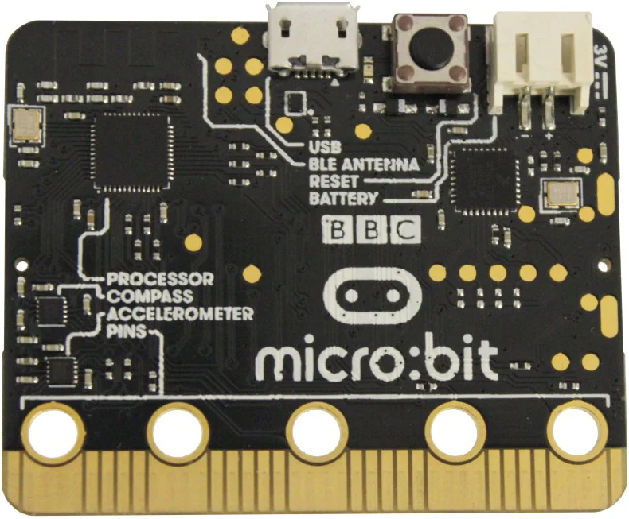

# Micro:bit - Coding Pirates Midtfyn

---

## Plan for dagen

- Velkommen
- Introduktion til micro:bit
- Login til micro:bit
- Missioner
- Kage!

---

## Mission!

- Multiplayer terning!
- Space Invaders!

---

---

---

## Hvad kan den?

- Vise tekst og billeder
- Reagere når du trykker på knapper
- Måle temperatur og bevægelse
- Kommunikere med andre micro:bits

---

## Sådan kommer vi i gang

0. Gå på internettet (Wifi: BORGERNET)
1. Start Browser (Chrome eller Firefox er bedst)
2. Gå til [microbit.org/join](https://microbit.org/join)
3. Login 

---

## micro:bit refresh

- Blokke i venstre side
- Input, Løkker, Logik, ...

---

## Din første kode

- Træk blokke fra menuen
- Sæt dem sammen som LEGO
- Se resultatet i simulatoren
- Overfør til din micro:bit

---

## Dagens mission(er)

- Multi-Player Terning

---

## Terning 0

- Lav et program der viser dit navn

---

## Terning 1

- Lav et program der viser et nyt tal mellem 1 og 6 hver gang du ryster microbitten

---

## Microbit Radio

- Microbit kan sende beskeder via radio
- Beskeder sendes på en kanal der hver har et gruppe nummer

---

## Terning 2

- Lav et program der sender en besked via radio når der trykkes på en knap
- Vis besked når du modtager en besked/streng

---

## Terning 3

- Lav et program der viser et nyt tal mellem 1 og 6 hver gang du ryster microbitten
- Send tallet via radio
- Modtag tal via radio
- Vis et ikon for ens, højere eller lavere
- Extra:
   - Se næste slide

---

## Terning 3 Extra

- Hav 3 liv
- Game over/Spil melodi når du har tabt 3 gange
- Vis terning v. tryk på A
- Vis liv v. tryk på B

---
 
## Dagens udvidede missioner

- Space Invader
- Du har et skib der kan flytte til venstre, højre og skyde
- Fjenden sender skibe mod dig
- Du får et point per fjende skib du rammer

---

## Space Invader 0

- Lav en sprite for skib 
- Tryk A, flyt sprite til venstre
- Tryk B, flyt sprite til højre

---

## Space Invader 1

- Samme som Space Invader 0
- Tryk A+B, Skyd en sprite op ad

---

## Space Invader 2

- Same some Space Invader 1
- Lav fjende der dukker op tilfældigt i første række
- Fly sprite ned ad 

---

## Sprite Invader 3

- Samme some Space Invader 2
- Hvis fjende rører dit skib "Game Over"
- Hvis dit skud rammer fjenden +1 Score

---

## Afslutning

- Hvad var det bedste ved det, du lavede?
- Hvad vil du prøve næste gang?

---

### Links

- [Space Invader Game](https://www.youtube.com/watch?v=ImPEoy-d_3w)
